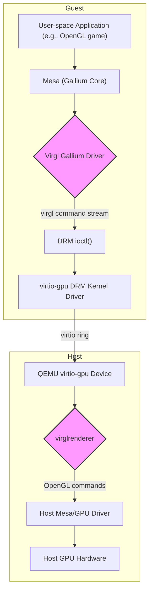

### Overview of Virgl

Virgl is a virtual 3D GPU for QEMU that allows a guest operating system to use the host's GPU for hardware-accelerated 3D rendering. It's designed to be an intermediate layer, translating a generic 3D command stream from the guest into API calls (typically OpenGL) on the host.

The main components are:

1.  **Mesa Virgl Gallium Driver (Guest)**: A user-space driver in the guest that translates Gallium3D hardware-independent IR into the `virgl` command stream.
2.  **`virtio-gpu` DRM Driver (Guest Kernel)**: A kernel driver in the guest that manages the `virtio-gpu` device and sends command buffers to the host.
3.  **`virtio-gpu` Device (QEMU, Host)**: The QEMU device emulation that receives command buffers from the guest.
4.  **`virglrenderer` Library (Host)**: A library used by QEMU's `virtio-gpu` device to translate the `virgl` command stream into host-side OpenGL calls.
5.  **Host GPU Driver (Host Kernel)**: The native driver for the host's GPU.

Here is a diagram illustrating the flow:

```mermaid
graph TD
    subgraph Guest
        A[User-space Application (e.g., OpenGL game)] --> B[Mesa (Gallium Core)];
        B --> C{Virgl Gallium Driver};
        C -- virgl command stream --> D[DRM ioctl()];
        D --> E[virtio-gpu DRM Kernel Driver];
    end

    subgraph Host
        F[QEMU virtio-gpu Device] --> G{virglrenderer};
        G -- OpenGL commands --> H[Host Mesa/GPU Driver];
        H --> I[Host GPU Hardware];
    end

    E -- virtio ring --> F;

    style C fill:#f9f,stroke:#333,stroke-width:2px
    style G fill:#f9f,stroke:#333,stroke-width:2px
```

### Detailed Step-by-Step Flow

1.  **Guest Application Rendering**
    An application inside the guest VM (e.g., a game or desktop compositor) uses a 3D graphics API like OpenGL. These API calls are not executed directly but are passed to the Mesa 3D library.

2.  **Mesa and Gallium3D (Guest)**
    Mesa's Gallium3D architecture acts as a translation layer. The OpenGL state and drawing commands are translated into a hardware-independent intermediate representation (IR) composed of "state objects" (for shaders, blend state, etc.) and drawing commands.

3.  **The Virgl Gallium Driver (Guest)**
    This is where `virgl` comes into play on the guest side. The `virgl` driver is a Gallium driver located in `src/gallium/drivers/virgl/`. Its job is to translate Gallium's hardware-independent IR into a command stream that the host's `virglrenderer` can understand.

    *   **Resource Creation**: When the application creates GPU resources like textures or buffers, the `virgl` driver creates corresponding `virgl`-specific objects and sends commands to the host to allocate them.
    *   **Command Buffer Generation**: For rendering, the driver generates a command buffer containing `virgl` opcodes. These opcodes instruct the host on how to set the rendering state (e.g., bind shaders, set blend state) and perform drawing operations. These commands are things like `VIRGL_CCMD_DRAW_VBO`, `VIRGL_CCMD_SET_FRAMEBUFFER_STATE`, etc. The driver builds these command buffers in memory.

4.  **Communicating with the Kernel (Guest)**
    Once a command buffer is ready, the user-space `virgl` driver needs to send it to the host. It does this by making an `ioctl` call to the `virtio-gpu` DRM device node (e.g., `/dev/dri/card0`). The primary `ioctl` is `DRM_IOCTL_VIRTGPU_EXECBUFFER`, which submits a command buffer for execution.

5.  **`virtio-gpu` Kernel Driver (Guest)**
    The guest's `virtio-gpu` kernel driver receives the `ioctl`. It places the command buffer into a `virtio` ring buffer, which is a shared memory region between the guest and the host. It then notifies the host that there are new commands to be processed.

6.  **QEMU and `virtio-gpu` Device (Host)**
    On the host, QEMU's `virtio-gpu` device model is notified of the new commands in the `virtio` ring. It pulls the command buffer from the shared memory.

7.  **`virglrenderer` (Host)**
    QEMU's `virtio-gpu` device itself doesn't understand the 3D commands. It passes them to the `virglrenderer` library. This library is the core of the host-side operation:
    *   It parses the `virgl` command stream.
    *   It maintains a shadow state of the guest's GPU state.
    *   It translates the `virgl` commands into the equivalent OpenGL (or GLES) calls for the host's GPU. For example, a `VIRGL_CCMD_CREATE_SHADER` from the guest causes `virglrenderer` to create a real OpenGL shader object on the host. A `VIRGL_CCMD_DRAW_VBO` becomes a `glDrawArrays` or similar call.

8.  **Host GPU Driver and Hardware**
    The OpenGL calls made by `virglrenderer` are handled by the host's native Mesa/GPU driver, which in turn sends commands to the physical GPU hardware for execution. The rendered result is then stored in a host-side resource. This result can be displayed in the QEMU window or shared with other applications on the host.

### 2D Commands and OpenGL Analogues

This brings us to the second part of your question. **Does it ever send 2D commands that have no OpenGL analogue?**

Yes, it does. The `virtio-gpu` specification, which `virgl` is built upon, includes a basic set of 2D commands for simple graphics operations. These are often used for the console, or for desktop environments when full 3D acceleration is not needed or available.

These 2D commands are more direct than their 3D counterparts and don't always have a clean 1:1 mapping to an OpenGL function. They are handled by the `virtio-gpu` device directly, often without involving `virglrenderer`'s 3D translation logic.

Examples of such 2D commands include:

*   `VIRTIO_GPU_CMD_RESOURCE_FLUSH`: This command flushes a 2D resource to a scanout (the visible display). This is analogous to a **blit**, where a portion of one surface is copied to another.

While you could implement a blit in OpenGL (e.g., by drawing a textured quad), the `VIRTIO_GPU_CMD_RESOURCE_FLUSH` command is a more direct, low-level operation designed for simple and efficient 2D updates. It's conceptually closer to a framebuffer copy operation than a 3D rendering primitive.

So, in summary, the `virtio-gpu` device has a dual nature:

1.  A **3D acceleration path** that uses `virglrenderer` to translate a rich 3D command stream into host OpenGL calls.
2.  A simpler **2D path** for basic framebuffer management and blitting, which is used for core display functionality and doesn't rely on a complex 3D API translation.

